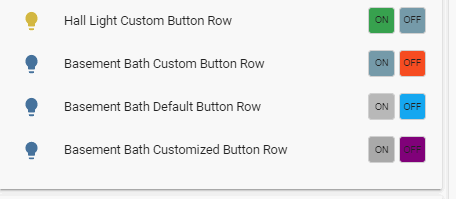
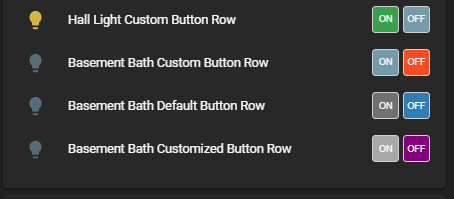
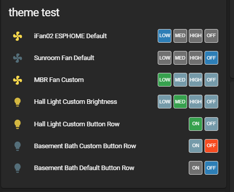

Changes:

- v1.2 - added the ability to customize the text for the buttons. defaults to "OFF, ON"

Provides a means to program a Lovelace button row to control any binary entity (lights, switches, input booleans, etc) that have the state as either on or off. This will also work for fans and dimmable lights that you would only ever like to switch on & off with a single speed or brightness setting (set outside the configuration for this plugin)

This plug-in was inspired by user @jazzyisj on the Home Assistant forum (community.home-assistant.io) as a thematically complementary plug-in for my fan control row & light brightness preset row.

Installation:

Copy the binary-control-button-row.js file to the appropriate folder in your Home Assistant Configuration directory (/config/www/).

Place the following in your "resources" section in your lovelace configuration (updating the localation to where you placed the above file):

  ```
    - url: /local/binary-control-button-preset-row.js
      type: js
  ```
    
Then to use this in a card place the following in your entity card:


<b>Options:</b>

| Name | Type | Required | Default | Description |
| --- | --- | --- | --- | --- |
| entity | String | Yes | none | any binary (on/off) entity_id |
| type | String | Yes | none | custom:binary-control-button-row |
| name | String | No | none | A custom name for the entity in the row |
| customTheme | Boolean | No | false | set to true to use a custom theme |
| IsOffColor | String | No | '#f44c09' | Sets the color of the 'Off' button if entity is off |
| IsOnColor | String | No | '#43A047' | Sets the color of the 'Low' button if entity is on low |
| ButtonInactiveColor | String | No | '#759aaa' | Sets the color of the the buttons if that selection is not "active" |
| customOffText | String | No | 'OFF' | Sets the text of the "off" button |
| customLowText | String | No | 'ON' | Sets the text of the "on" button |

The values for the colors can be any valid color string in "HEX", "RGB" or by color name.

<b>Configuration Examples:</b>
    
  ```
    cards:
      - type: entities
        title: Binary Buttons
        show_header_toggle: false
        entities:
        ## USE THIS CONFIG TO HAVE IT MATCH YOUR THEME ##
          - type: custom:binary-control-button-row
            name: Basement Bath Default Button Row
            entity: light.sengled_e11g13_03070a4c_1
            customTheme: false
        ## USE THIS CONFIG TO USE A DEFAULT CUSTOM THEME
          - type: custom:binary-control-button-row
            name: Basement Bath Custom Button Row
            entity: light.basement_bath_light
            customTheme: true
        ## USE THIS CONFIG TO USE A 'CUSTOMZED' CUSTOM THEME
          - type: custom:binary-control-button-row
            name: Basement Bath Customized Button Row
            entity: light.sengled_e11g13_03070a4c_1
            customTheme: true
            IsOnColor: 'rgb(255, 0, 0)'
            IsOffColor: 'purple'
            ButtonInactiveColor: '#aaaaaa'
        ## USE THIS CONFIG TO SET CUSTOM BUTTON TEXT (NOT REQUIRED TO SET "customTheme: true" TO USE THESE )
          - type: custom:binary-control-button-row
            name: Basement Bath Customized Button Row
            entity: light.sengled_e11g13_03070a4c_1
            customOnText: yay
            customOffText: nay
            
  ```

This is with the default Lovelace frontend theme set:




This is with the "Slate" frontend theme set:



this is how this plugin looks with the Fan control & Light Brightness Rows:


